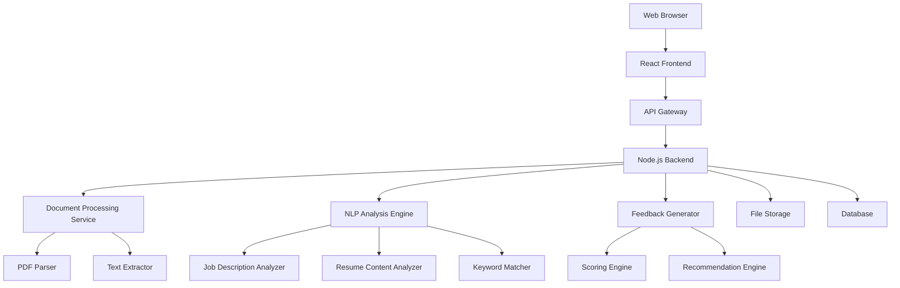

# Design Document

## Overview

The Resume Review Tool is a web-based application that provides automated resume analysis and feedback. The system uses natural language processing and machine learning techniques to analyze resume content against job descriptions and industry best practices, delivering actionable recommendations to improve job application success rates.

The application follows a modern web architecture with a React frontend, Node.js backend, and cloud-based document processing services. The design emphasizes user experience, data security, and scalable performance to handle concurrent users during peak periods.

## Architecture

### High-Level Architecture



### Technology Stack

**Frontend:**
- React 18 with TypeScript
- Material-UI for component library
- React Query for state management and caching
- React Hook Form for form handling
- Recharts for data visualization

**Backend:**
- Node.js with Express.js framework
- TypeScript for type safety
- Multer for file upload handling
- PDF-parse for PDF text extraction
- Natural language processing libraries (compromise.js, sentiment)

**Infrastructure:**
- AWS S3 for temporary file storage
- AWS Lambda for serverless processing
- PostgreSQL for metadata storage
- Redis for caching and session management
- Docker for containerization

## Components and Interfaces

### Frontend Components

#### 1. Upload Component
- **Purpose:** Handle resume file uploads and validation
- **Props:** `onFileUpload`, `acceptedFormats`, `maxFileSize`
- **State:** `uploadProgress`, `validationErrors`, `uploadedFile`
- **Features:**
  - Drag-and-drop interface
  - File format validation
  - Progress indicator
  - Error handling and user feedback

#### 2. Job Description Input Component
- **Purpose:** Capture and validate job description text
- **Props:** `onJobDescriptionChange`, `maxLength`
- **State:** `jobDescription`, `characterCount`, `validationErrors`
- **Features:**
  - Rich text editor with formatting
  - Character count display
  - Auto-save functionality
  - Paste from clipboard support

#### 3. Analysis Results Component
- **Purpose:** Display comprehensive feedback and scoring
- **Props:** `analysisResults`, `onExportPDF`
- **State:** `selectedCategory`, `expandedSections`
- **Features:**
  - Tabbed interface for different feedback categories
  - Interactive scoring visualizations
  - Expandable recommendation sections
  - Export functionality

#### 4. Progress Indicator Component
- **Purpose:** Show analysis progress and status
- **Props:** `currentStep`, `totalSteps`, `processingMessage`
- **State:** `progress`, `estimatedTime`
- **Features:**
  - Multi-step progress visualization
  - Real-time status updates
  - Estimated completion time

### Backend Services

#### 1. File Processing Service
```typescript
interface FileProcessingService {
  uploadFile(file: File): Promise<FileMetadata>;
  extractText(fileId: string): Promise<ExtractedContent>;
  validateFile(file: File): ValidationResult;
  cleanupFile(fileId: string): Promise<void>;
}
```

#### 2. Analysis Engine Service
```typescript
interface AnalysisEngineService {
  analyzeResume(content: ExtractedContent, jobDescription?: string): Promise<AnalysisResult>;
  scoreCompatibility(resume: ResumeData, jobRequirements: JobRequirements): Promise<CompatibilityScore>;
  generateRecommendations(analysisResult: AnalysisResult): Promise<Recommendation[]>;
}
```

#### 3. Feedback Generation Service
```typescript
interface FeedbackGenerationService {
  generateReport(analysisResult: AnalysisResult): Promise<FeedbackReport>;
  exportToPDF(report: FeedbackReport): Promise<Buffer>;
  categorizeRecommendations(recommendations: Recommendation[]): CategorizedRecommendations;
}
```

## Data Models

### Resume Data Model
```typescript
interface ResumeData {
  id: string;
  fileName: string;
  uploadedAt: Date;
  content: {
    rawText: string;
    sections: {
      contactInfo: ContactInfo;
      summary: string;
      experience: WorkExperience[];
      education: Education[];
      skills: string[];
      certifications: Certification[];
    };
  };
  metadata: {
    fileSize: number;
    pageCount: number;
    format: string;
  };
}
```

### Job Description Model
```typescript
interface JobDescription {
  id: string;
  content: string;
  extractedRequirements: {
    requiredSkills: string[];
    preferredSkills: string[];
    experienceLevel: string;
    education: string[];
    certifications: string[];
    keywords: string[];
  };
  processedAt: Date;
}
```

### Analysis Result Model
```typescript
interface AnalysisResult {
  id: string;
  resumeId: string;
  jobDescriptionId?: string;
  overallScore: number;
  categoryScores: {
    content: number;
    structure: number;
    keywords: number;
    experience: number;
    skills: number;
  };
  recommendations: Recommendation[];
  strengths: string[];
  improvementAreas: string[];
  analyzedAt: Date;
}
```

### Recommendation Model
```typescript
interface Recommendation {
  id: string;
  category: 'content' | 'structure' | 'keywords' | 'experience' | 'skills';
  priority: 'high' | 'medium' | 'low';
  title: string;
  description: string;
  examples: {
    before?: string;
    after: string;
  };
  impact: string;
}
```

## Error Handling

### Frontend Error Handling
- **File Upload Errors:** Display user-friendly messages for unsupported formats, file size limits, and network issues
- **Analysis Errors:** Show retry options and alternative approaches when analysis fails
- **Network Errors:** Implement retry logic with exponential backoff
- **Validation Errors:** Provide real-time feedback with specific correction guidance

### Backend Error Handling
- **File Processing Errors:** Log detailed errors while returning sanitized messages to frontend
- **Analysis Engine Errors:** Implement fallback analysis methods for partial failures
- **External Service Errors:** Circuit breaker pattern for third-party service dependencies
- **Database Errors:** Transaction rollback and data consistency checks

### Error Response Format
```typescript
interface ErrorResponse {
  error: {
    code: string;
    message: string;
    details?: any;
    timestamp: Date;
    requestId: string;
  };
}
```

## Testing Strategy

### Unit Testing
- **Frontend:** Jest and React Testing Library for component testing
- **Backend:** Jest for service and utility function testing
- **Coverage Target:** 90% code coverage for critical paths

### Integration Testing
- **API Testing:** Supertest for endpoint testing with mock data
- **File Processing:** Test with various resume formats and edge cases
- **Analysis Engine:** Validate analysis accuracy with known resume samples

### End-to-End Testing
- **User Workflows:** Cypress for complete user journey testing
- **Cross-browser Testing:** Automated testing across Chrome, Firefox, Safari
- **Mobile Responsiveness:** Testing on various device sizes and orientations

### Performance Testing
- **Load Testing:** Artillery.js for concurrent user simulation
- **File Processing:** Test with large files and various formats
- **Analysis Speed:** Benchmark analysis time for different resume complexities

### Security Testing
- **File Upload Security:** Test for malicious file uploads and validation bypasses
- **Data Privacy:** Verify proper data cleanup and encryption
- **Input Validation:** Test for injection attacks and malformed data

## Deployment and Infrastructure

### Development Environment
- Docker Compose for local development
- Hot reloading for frontend and backend
- Local PostgreSQL and Redis instances
- Mock external services for testing

### Production Environment
- AWS ECS for container orchestration
- Application Load Balancer for traffic distribution
- Auto-scaling groups for handling variable load
- CloudWatch for monitoring and alerting
- AWS WAF for security protection

### CI/CD Pipeline
- GitHub Actions for automated testing and deployment
- Automated security scanning with Snyk
- Database migration management
- Blue-green deployment strategy for zero-downtime updates

### Monitoring and Observability
- Application metrics: Response times, error rates, user engagement
- Infrastructure metrics: CPU, memory, network usage
- Business metrics: Analysis completion rates, user satisfaction scores
- Log aggregation with structured logging format